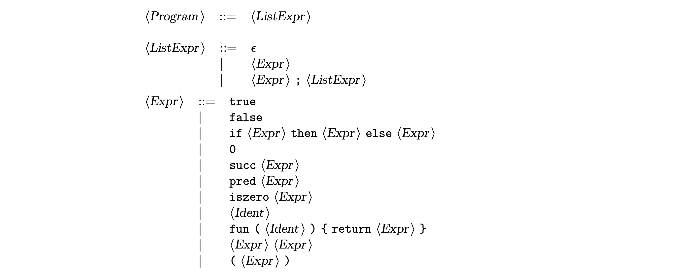

# Lab 1 (in Java). Untyped expressions, functions and nameless representation

_This is a Java version of materials demonstrated in [Lab 1](../lab-01/)._

In this lab, we discuss implementation of an interpreter for simple untyped expressions with functions, relying on intermediate nameless representation to deal with possible name conflicts.

[](doc/Syntax/Normal.pdf)

The language employs **call-by-name** evaluation strategy.

## Project structure

Syntax for normal and nameless representation of terms is defined using a labelled BNF in files `Syntax/Normal.cf` and `Syntax/Nameless.cf` correspondingly. BNF converter tool is used to generate parser, abstract syntax, and pretty printer automatically.

## How to use

The generated parser `Test` reads standard input, parses a series of expressions separated by a semicolon (`;`), evaluates each expression and prints out the results.

```sh
echo "(fun (x) { return (pred x) })(succ (succ 0))" | java Syntax.normal.Test
```
```
Parse Succesful!

[Abstract Syntax]

(ProgramExprs [(Application (Abstraction "x" (Pred (Var "x"))) (Succ (Succ ConstZero)))])

[Linearized Tree]

fun (x)
{
  return pred x}
```

Some example programs are available in the `examples/` directory:

```sh
cat examples/booleans.example | java Syntax.normal.Test
```

```
Parse Succesful!

[Abstract Syntax]

(ProgramExprs [ConstTrue, ConstFalse, (If ConstTrue ConstFalse ConstTrue), (If (If ConstTrue ConstFalse ConstTrue) ConstFalse ConstTrue)])

[Linearized Tree]

true;
false;
if true then false else true;
if if true then false else true then false else true
```

## How to build

### Prerequisites

This lab uses Java programming language, [ANTLRv4](https://www.antlr.org/download.html) parser generator, and [BNF Converter tool](http://bnfc.digitalgrammars.com) for demo implementation.

To install BNF converter tool, follow instructions on their [official website](http://bnfc.digitalgrammars.com). For example, you can use the Stack tool:

```sh
stack install BNFC
```

To use BNF converter with the Java implementation, you will also need to install ANTLRv4 (or Cup and JLex). Follow instructions on the official site. You might also be interested in [ANTLR Mega Tutorial](https://tomassetti.me/antlr-mega-tutorial/), in particular its [Setup ANTLR section](https://tomassetti.me/antlr-mega-tutorial/#chapter11).

### Building the interpreter

You probably want to clean up previous build files first:

```sh
make clean
```

To run BNF converter, generate source files, run ANTLR, and compile, simply run:

```sh
make
```

This should generate `Syntax/normal/Test.class` and `Syntax/nameless/Test.class` files that you can now use to test parsing of the source code in the target language.

### Generating the PDF with syntax description

Run BNF converter with `--latex` option and use `pdflatex` or `latexmk` to compile a PDF.
Assuming you have `latexmk` and `pdflatex` installed, you can simply run

```sh
make pdf
```

This will generate PDF files `doc/Syntax/Normal.pdf` and `doc/Syntax/Nameless.pdf`.
